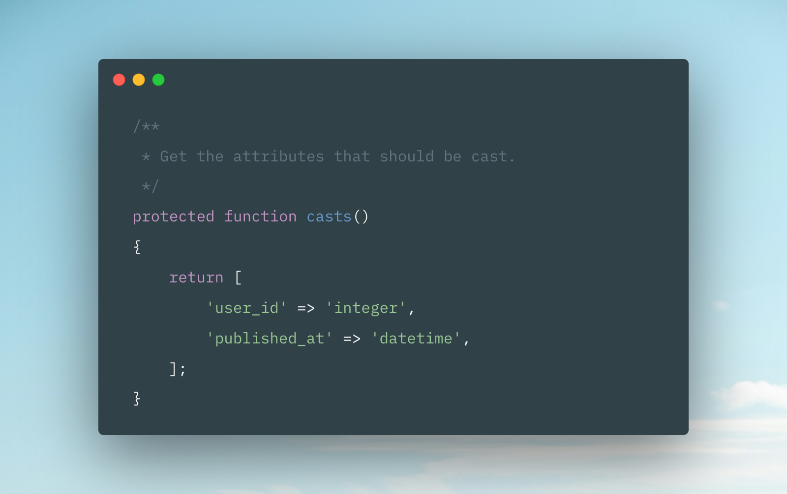

# Larastan Casts Method

Larastan Casts Method is a PHPStan extension that enhances Laravel model analysis by automatically inferring the return type of the casts method. This eliminates the need to manually maintain return types in docblocks as array shapes, reducing boilerplate and potential errors.

# Features

- Automatically infers the return type of Laravel models’ casts method.
- Eliminates the need for manual docblock annotations for casts.
- Seamlessly integrates with Larastan and PHPStan.
- Supports Laravel 11 and above. 

Installation

You can install the package via Composer:

```bash
composer require --dev titasgailius/larastan-casts-method
```

# Usage

Include the extension **before** the Larastan extension.

```diff
includes:
+  - vendor/titasgailius/larastan-casts-method/extension.neon
  - vendor/larastan/larastan/extension.neon
```

### Before

```php
/**
 * Get the attributes that should be cast.
 *
 * @return array{
 *     user_id: 'integer',
 *     published_at: 'datetime',
 * }
 */
public function casts(): array
{
    return [
        'user_id' => 'integer',
        'published_at' => 'datetime',
    ];
}
```

### After

```php
/**
 * Get the attributes that should be cast.
 */
public function casts(): array
{
    return [
        'user_id' => 'integer',
        'published_at' => 'datetime',
    ];
}
```
