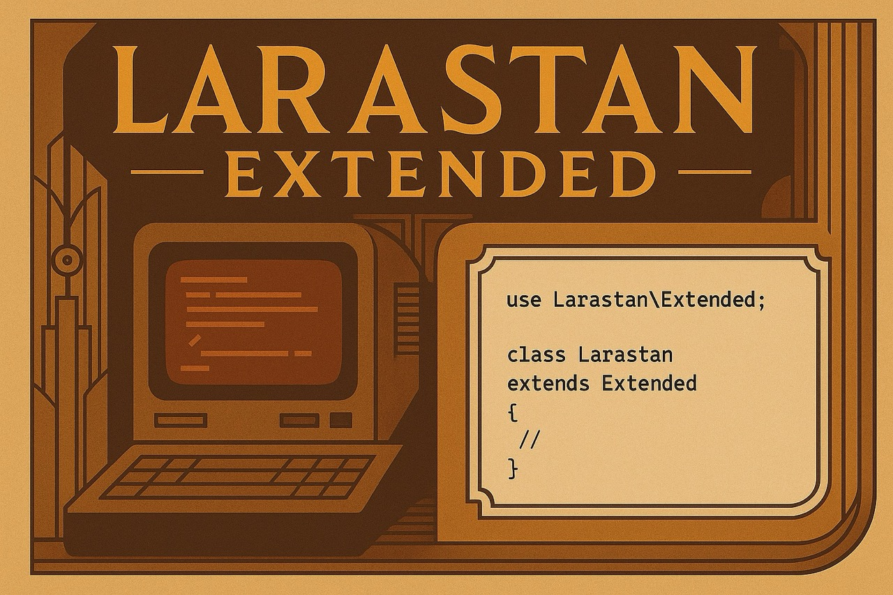

<p align="center">
    
</p>

# Larastan Extended

Larastan Extended is an opinionated Larastan extension that inspects your Laravel application to make static analysis less verbose.

# Features

## Automatically infer the return type of the casts method.

```diff
/**
 * Get the attributes that should be cast.
- *
- * @return array{
- *     user_id: 'integer',
- *     published_at: 'datetime',
- * }
 */
public function casts(): array
{
    return [
        'user_id' => 'integer',
        'published_at' => 'datetime',
    ];
}
```

## Detect non-nullable $request->user() calls in authenticated routes.

```diff
Route::get('posts', function (Request $request) {
-    /** @var \App\Models\User */
-    $user = $request->user();
-
-    return $user->posts;
+    return $request->user()->posts;
})->middleware('auth');
```

## Detect non-nullable relationships.

```diff
Route::get('teams/{team}/owner', function (Team $team) {
-  /** @var \App\Models\User */
-  $owner = $team->owner;
-
-  return $owner;
+  return $team->owner;
});
```

# Installation

You can install the package via Composer:

```bash
composer require --dev titasgailius/larastan-extended
```

# Usage

Include the extension **before** the Larastan extension.

```diff
includes:
+ - vendor/titasgailius/larastan-extended/extension.neon
  - vendor/larastan/larastan/extension.neon
```
