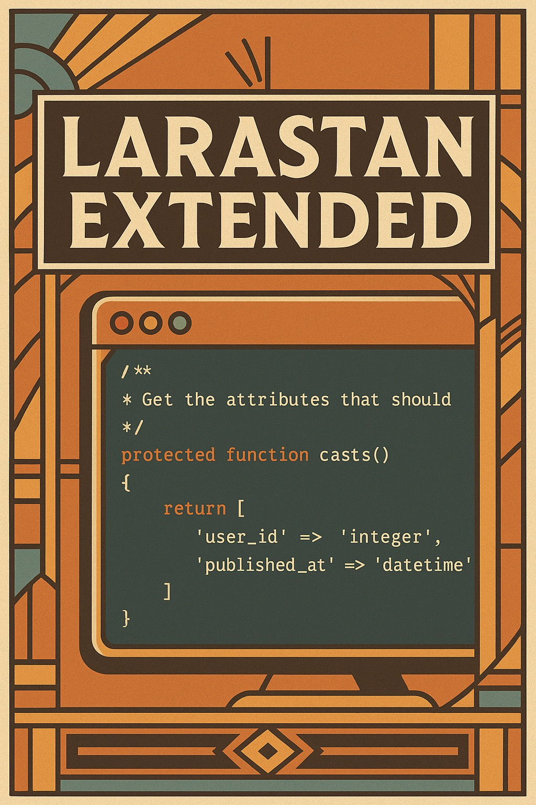

<p align="center">
    
</p>

# Larastan Extended

Larastan Extended is an opinionated extension for Larastan that adds powerful developer-focused features.

# Features

- Automatically infers the return type of Laravel models’ casts method.
- Eliminates the need for manual docblock annotations for casts.

Installation

You can install the package via Composer:

```bash
composer require --dev titasgailius/larastan-extended
```

# Usage

Include the extension **before** the Larastan extension.

```diff
includes:
+ - vendor/titasgailius/larastan-extended/extension.neon
  - vendor/larastan/larastan/extension.neon
```

# Model Casts Example

### Before

```php
/**
 * Get the attributes that should be cast.
 *
 * @return array{
 *     user_id: 'integer',
 *     published_at: 'datetime',
 * }
 */
public function casts(): array
{
    return [
        'user_id' => 'integer',
        'published_at' => 'datetime',
    ];
}
```

### After

```php
/**
 * Get the attributes that should be cast.
 */
public function casts(): array
{
    return [
        'user_id' => 'integer',
        'published_at' => 'datetime',
    ];
}
```

# Configuration

The model casts extension can be disabled.

```yaml
parameters:
    runModelCasts: false
```

Specific models can be excluded from the analysis.

```yaml
parameters:
    skipModelCastsFor:
        - App\Models\Team
```
